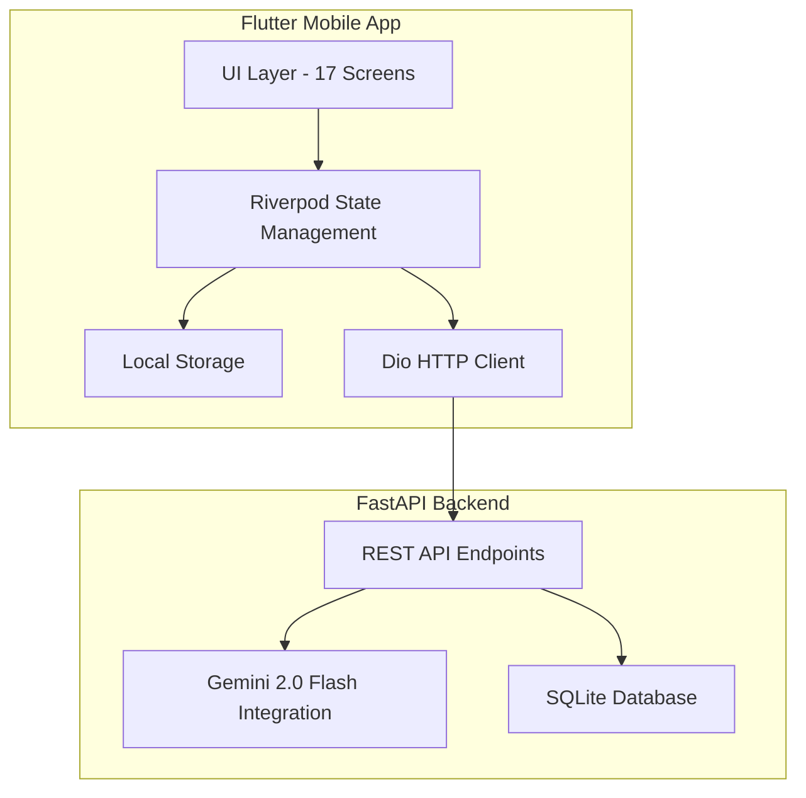

# Pulse — Business Intelligence Platform
Pulse is a production-grade business intelligence platform built with Flutter and a FastAPI Python backend. It utilizes the Gemini 2.0 Flash API to ingest, analyze, assess, plan, and simulate actions based on unstructured data.

## Architecture


## Setup Instructions

### 1. Backend Setup (FastAPI)
1. Navigate to the `backend` directory:
   ```bash
   cd backend
   ```
2. Install Python dependencies:
   ```bash
   pip install -r requirements.txt
   ```
3. Set up the Gemini API Key:
   - Rename `.env.example` to `.env`.
   - Open `.env` and replace `your_key_here` with your actual Gemini API Key.
   ```env
   GEMINI_API_KEY=your_actual_api_key_here
   ```
4. Run the backend server:
   ```bash
   uvicorn main:app --reload
   ```
   The server will run at `http://localhost:8000`.

### 2. Frontend Setup (Flutter)
1. Ensure you have Flutter SDK installed and configured.
2. Navigate to the root directory (where `pubspec.yaml` is located).
3. Get Flutter dependencies:
   ```bash
   flutter pub get
   ```
4. Run the app on an emulator or physical device:
   ```bash
   flutter run
   ```

## Demo Scenario Walkthrough

**Input:**
> "Q1 Sales Report Lahore: Orders down 25%, revenue PKR 14.2M to 10.6M, complaints up 40%, competitor launched 30% discount 6 weeks ago, warehouse at 340% capacity"

**Steps to Demo:**
1. Open the app and go through the onboarding screens.
2. Tap the `+` FAB on the Home Screen to open the Input Screen.
3. Select the `Business` domain.
4. Paste the input text above into the text area.
5. Tap **Run Analysis**.
6. Watch the Processing Screen as the agentic pipeline moves through 5 stages (Reading → Analyzing → Assessing → Planning → Executing), displaying real-time logs underneath each node.
7. Once finished, you will be automatically taken to the **Results Screen**, which has 4 tabs:
   - **Insights**: 5 non-obvious insights generated with confidence scores, severity (Critical), and tags.
   - **Actions**: 3 ranked actions (e.g., counter-campaign, inventory clear, customer recovery) with priorities and expected outcomes.
   - **Execution**: View the simulated email draft, CRM record update JSON diff, and Dashboard metric update (e.g., Revenue down by ~25.3%).
   - **Raw Signals**: Shows all 6+ signals extracted from the text.
8. Tap the "Summarize" icon in the app bar to view the **Report Screen** and see the severity overview and export options.

## 📸 Screenshots

.jpeg)

.jpeg)
.jpeg)

.jpeg)

.jpeg)

.jpeg)

.jpeg)


.jpeg)

.jpeg)

.jpeg)


